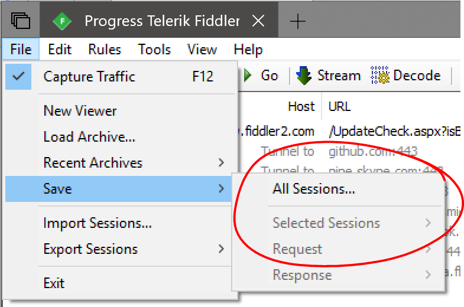
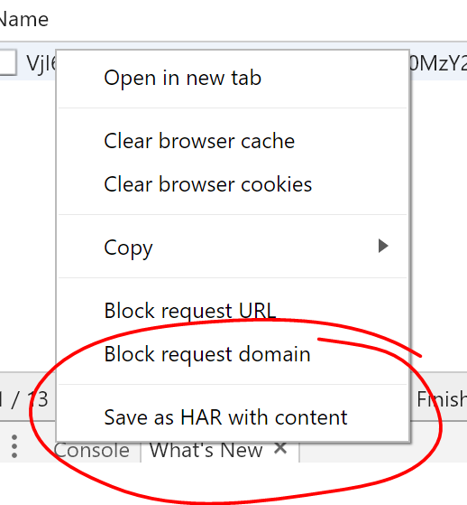
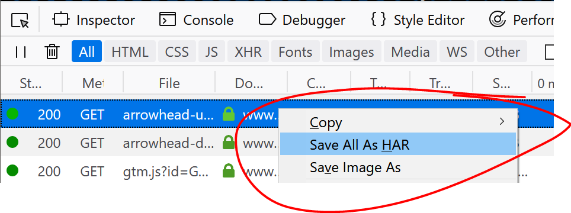
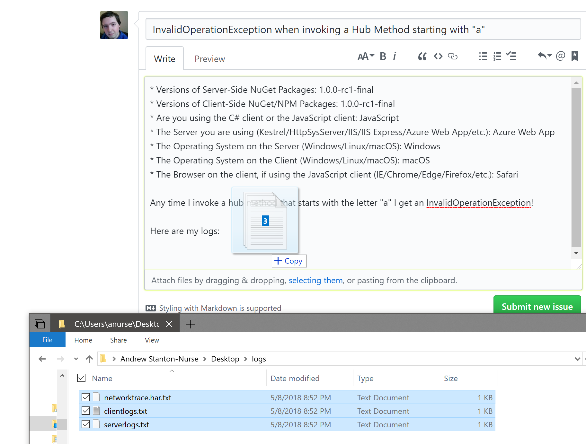

# Diagnostics

By [Andrew Stanton-Nurse](https://twitter.com/anurse)

This article provides guidance for gather diagnostics from your SignalR application to help troubleshoot issues.

## Server-Side Logging

> [!NOTE]
> Server-side logs may contain sensitive information from your application. **Never** post raw logs from production applications to public forums like GitHub.

Since SignalR is part of ASP.NET Core, it uses the ASP.NET Core Logging system. In the default configuration, SignalR logs very little information, but this can configured. See the documentation on [ASP.NET Core Logging](xref:fundamentals/logging/index#configuration) for details on configuring ASP.NET Core logging.

SignalR uses two logging prefixes:

* `Microsoft.AspNetCore.SignalR` - for logs related to Hub Protocols, activating Hubs, invoking methods, etc.
* `Microsoft.AspNetCore.Http.Connections` - for logs related to transports such as WebSockets, Long Polling and Server-Sent Events.

To enable detailed logs from SignalR, configure both of these prefixes to the `Debug` level in your `appsettings.json` file by adding the following items to the `LogLevel` sub-section in `Logging`:

[!code-javascript[Configuring logging](diagnostics/logging-config.json?highlight=7-8)]

You can also configure this in code in your `CreateWebHostBuilder` method:

[!code-csharp[Configuring logging in code](diagnostics/logging-config-code.cs?highlight=5-6)]

If you aren't using JSON-based configuration, set the following configuration values in your configuration system:

* `Logging::LogLevel::Microsoft.AspNetCore.SignalR` = `Debug`
* `Logging::LogLevel::Microsoft.AspNetCore.Http.Connections` = `Debug`

## Accessing Server-Side Logs
How you access server-side logs depends on the environment in which you are running.

### As a console app outside IIS

If you are running in a console app, the [Console logger](xref:fundamentals/logging/index#console-provider) should be enabled by default and SignalR logs will appear on the console.

### Within IIS Express from Visual Studio

Visual Studio shows the log output in the Output Window in the "ASP.NET Core Web Server" drop down option.

### Azure App Service

Enable the "Application Logging (Filesystem)" option in the "Diagnostics logs" section of the Azure App Service portal and configure the Level to `Verbose`. Logs should be available from the "Log streaming" service, as well as in logs on the file system of your App Service. See the documentation on [Azure log streaming](xref:fundamentals/logging/index#azure-log-streaming) for more information.

### Other environments

If you are running in another environment (Docker, Kubernetes, Windows Service, etc.), see the full documentation on [ASP.NET Core Logging](xref:fundamentals/logging/index) for more information on how to configure logging providers suitable to your environment.

## JavaScript client logging

> [!NOTE]
> Client-side logs may contain sensitive information from your application. **Never** post raw logs from production applications to public forums like GitHub.

When using the JavaScript client, you can configure logging options using the `.configureLogging` method on `HubConnectionBuilder`:

[!code-javascript[Configuring logging in the JavaScript client](diagnostics/logging-config-js.js?highlight=3)]

> [!NOTE]
> To disable logging entirely, specify `signalR.LogLevel.None` in the `configureLogging` method.

Log levels available to the JavaScript client are listed below. Setting the log level to one of these values enables logging of message at that level, as well as all log levels above it on the table below:

| Level | Description |
| ----- | ----------- |
| `None` | No messages are logged. |
| `Critical` | Messages that indicate a failure in the entire app. |
| `Error` | Messages that indicate a failure in the current operation. |
| `Warning` | Messages that indicate a non-fatal problem. |
| `Information` | Informational messages. |
| `Debug` | Diagnostic messages useful for debugging. |
| `Trace` | Very detailed diagnostic messages designed for diagnosing specific issues. |

Once you've configured the verbosity, the logs will be written to the Browser Console (or Standard Output in a NodeJS application).

If you want to send logs to a custom logging system, you can provide a JavaScript object implementing the `ILogger` interface. The only method that needs to be implemented is `log`, which takes the level of the event and the message associated with the event. For example:

[!code-typescript[Creating a custom logger](diagnostics/custom-logger.ts?highlight=3-7,13)]

## .NET client logging

> [!NOTE]
> Client-side logs may contain sensitive information from your application. **Never** post raw logs from production applications to public forums like GitHub.

To get logs from the .NET client, you can use the `.ConfigureLogging` method on `HubConnectionBuilder`. This works the same way as the `.ConfigureLogging` method on `WebHostBuilder` and `HostBuilder`. You can configure the same logging providers you use in ASP.NET Core. However, you have to manually install and enable the NuGet packages for the individual logging providers.

### Console logging

In order to enable Console logging, add the `Microsoft.Extensions.Logging.Console` nuget package. Then, use the `AddConsole` method to configure the console logger:

[!code-csharp[Configuring console logging in .NET client](diagnostics/net-client-console-log.cs?highlight=6)]

### Debug output window logging

You can also configure logs to go to the Output Window in Visual Studio. Install the `Microsoft.Extensions.Logging.Debug` package and use the `AddDebug` method:

[!code-csharp[Configuring debug output window logging in .NET client](diagnostics/net-client-debug-log.cs?highlight=6)]

### Other logging providers

You can also use other logging providers such as Serilog, Seq, NLog, or any other logging system that integrates with `Microsoft.Extensions.Logging`. If your logging system provides an `ILoggerProvider`, you can register it with `.AddProvider`:

[!code-csharp[Configuring a custom logging provider in .NET client](diagnostics/net-client-custom-log.cs?highlight=6)]

### Controlling verbosity

If the debug logs are too verbose, you can set the default minimum level to `Information` and just increase the logging level for SignalR logs. This can be done in code, in much the same was as on the server:

[!code-csharp[Controlling verbosity in .NET client](diagnostics/logging-config-client-code.cs?highlight=8-10)]

## Network traces

> [!NOTE]
> A network trace contains the full contents of every message sent by your application. **Never** post raw network traces from production applications to public forums like GitHub.

If you encounter an issue, a network trace can sometimes provide a lot of helpful information. This is particularly useful if you are going to file an issue on our issue tracker.

### Using Fiddler (preferred option)

This method works for all apps.

Fiddler is a very powerful tool for collecting HTTP traces. Install it from [telerik.com/fiddler](https://www.telerik.com/fiddler), launch it, and then run your application and reproduce the issue. Fiddler is available for Windows, and there are beta versions for macOS and Linux.

If you connect using HTTPS, there are some extra steps to ensure Fiddler can decrypt the HTTPS traffic. See the [Fiddler Documentation](https://docs.telerik.com/fiddler/Configure-Fiddler/Tasks/DecryptHTTPS) for more details.

Once you've collected the trace, you can export the trace by choosing "File" > "Save" > "All Sessions..." from the menu bar.



### Using tcpdump (macOS and Linux only)

This method works for all apps.

You can collect raw TCP traces using tcpdump by running the following command from a terminal window. You may need to be `root` or prefix the command with `sudo` if you get a permissions error:

```
tcpdump -i [interface] -w trace.pcap
```

Replace `[interface]` with the network interface you wish to capture on. Usually this is something like `/dev/eth0` (for your standard Ethernet interface) or `/dev/lo0` (for localhost traffic). See the `tcpdump` man page on your host system for more information.

### Using a browser

This method only works for browser-based apps.

You can also use a browser to capture some network traffic.

> [!NOTE]
> Most browsers don't include WebSocket and Server-Sent Event messages in exported network traces. If you are using those transports, using a tool like Fiddler or TcpDump (described below) is a better approach.

Most browser Developer Tools have a "Network" tab that allows you to capture network activity between the browser and the server.

#### Microsoft Edge and Internet Explorer

(The instructions are the same for both Edge and Internet Explorer)

1. Press F12 to open the Dev Tools
2. Click the Network Tab
3. Refresh the page (if needed) and reproduce the problem
4. Click the Save icon in the toolbar to export the trace as a "HAR" file:


#### Google Chrome

1. Press F12 to open the Dev Tools
2. Click the Network Tab
3. Refresh the page (if needed) and reproduce the problem
4. Right click anywhere in the list of requests and choose "Save as HAR with content":



#### Mozilla Firefox

1. Press F12 to open the Dev Tools
2. Click the Network Tab
3. Refresh the page (if needed) and reproduce the problem
4. Right click anywhere in the list of requests and choose "Save All As HAR"



## Attaching Diagnostics files to GitHub issues

You can attach Diagnostics files to GitHub issues by renaming them so they have a `.txt` extension and then dragging and dropping them on to the issue.

> [!NOTE]
> Please do not paste the content of log files or network traces in GitHub issue. These logs and traces can be quite large and GitHub will usually truncate them.



## Additional resources

* <xref:signalr/configuration>
* <xref:signalr/javascript-client>
* <xref:signalr/dotnet-client>
